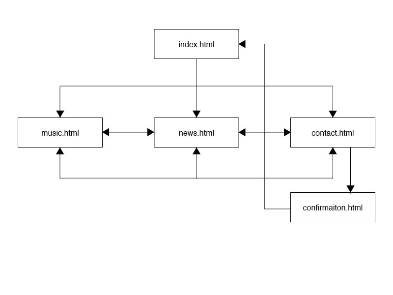

<h1> This is Icarus</h1>

<h2>Final site address</h2>
https://sammydartnall10.github.io/ucd-icarus/

<h2>About this page</h2>
<h3> This webpage is made for the first code institue module  </h3>

Made as a means of promoting the existing band, Icarus, it consists of:
An index page, with the band name and current/past event listings. 
Music linking to youtube videos is on the second page. 
News, pictures and blog posts can be found under the blog page, and a contact form is availble to send messages to the band. 
The 'send' functionality of the form is not yet active, as it is not a required part of the assessment, however a confirmation page has been created to reflect the behaviour of the form. 

Bootstrap has been used to structure the page, and provide features such as a jumbotron (see blog page).
This has then been styled using my own CSS to change font, colour and look and feel of the site. 

<h2>UX</h2>
This site is designed for and aimed at a variety of users.

Fans of the band will have heard of and know the band already, and have the main goal of wanting to hear recent releases, keep up to date with news and find out when they are next playing. 

Other artists that have heard the band and are interesed in collaborating will need a means to contact the band with such requests. 

Promoters and managers wanting to hire the band for gigs/festivals will need a means to hear the music they play, and also a means to get in touch if they like what they hear. 

New listeners that that are looking to find out more about the band will be looking to hear more music, and find out about the band, current news and where they are playing. 

The architecture of the site is as follows: 

All pages will have an 'in' and and 'out'- ie the user is never stuck on one page. 

<h2>Features</h2>
The website has a number of deployed features, but also a few that may be implemented at a later date. 

<h3>Existing Features</h3>
Feature 1 - allows users to listen to new releases, without losing the webpage through embedding youtibe videos into the site 

Feature 2 - the blog posts collate the latests news for the band, but not the full article (and so not taking up the whole page). To reduce the overhead of the site, users wanting to read more of an article can click the link to be taken to an external page. target=_blank opens this on a new page however, so the user can find their way back. 

Feature 3 - the form allows users to quickly request for the band to get in touch via email - and the conformation page lets the user know this request has gone through.

Feature 4 - on index.html, the user can scroll down to find the events the band are next at- these links will take them to a site where they may purchse tickets. 

Feature 5 - "catch up" links on the index.html takes user to the bands social media pages, where they can find content on gigs/concerts already played at. 

<h3>Features Left to Implement</h3>

A chat feature could either contact the band, or take a question and send it to a socail media site such as twitter for the bands to answer. 

<h2>Technologies Used</h2>

A combination of HTML5 and CSS has been used thoughout this project. 

For site styling and stucture, the Bootstraplibrary has been employed across the site. Bootstrap documentation can be found here: https://getbootstrap.com/docs/4.1/getting-started/introduction/

In addition to bootstrap, custom styling has been added, and can be found in the assets/styles.css file. 

<h2>Testing </h2>

For this project, testing was carried out manually, both in the browser and with Google developer tools to test different screen sizes.

HTML was validated using the Markup Validation Service provided by The World Wide Web Consortium (W3C): https://validator.w3.org/

CSS was validated using the CSS Validation Service provided by The World Wide Web Consortium (W3C): https://jigsaw.w3.org/css-validator/

Index Page:
Able to scroll down, and find and click on links to external pages

Music Page:
Able to click on, play, pause music videos while on the page. 

News Page: 
Able to click on and be taken to external resources 

Contact form:
Go to the "Contact Us" page
Try to submit a form with content -> conformation page will appear
Try to submit an empty form -> error message saying "please enter email" appears

<h2>Deployment</h2>
GitHub has been used throughout this project to maintain version control as feature are added. After adding a new feature, the code is pushed to GitHub. 

The site has also been deployed using GitHub pages - this is simply a process of in settings for the project, setting source to master branch under GitHub pages and saving the changes. The resulting link can then be used to access the page. 

<h2>Credits</h2>

<h3>Content</h3>
The intro text for the music page has been taken from thier biography on spotify (found here: https://open.spotify.com/artist/0nUF7iT0e6D5xEl743Jfu3/about)

<h3>Media</h3>
Intro text and images of the band in each of the news articles has been taken from the articles themselves, found here: 
https://londontheinside.com/interview-icarus/
and here:
https://www.fabriclondon.com/blog/view/introducing-icarus-and-their-indicative-promotional-mix

<h2>Acknowledgements</h2>
I received inspiration for this project from the band themsleves, thier social media and online content - as current artists I have tried to produce something that was in keeping with their look and feel. 

I also received direction from my mentor in how best tackle a project like this, and to further understanding of technolgies such as bootstrap, and how to use the library in a way that doesnt conflict with custom CSS (ie, stop things from jumping around to where they shouldnt!)